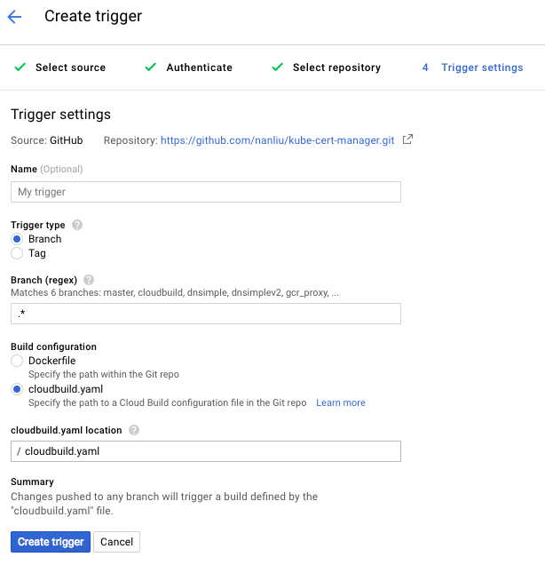

# Building kube-cert-manager using Google Cloud Container Builder

You can use Google Cloud Container Builder to generate and push container images to gcr.io under your project id.

## Container Builder Configuration

In Google Cloud Platform:

* select [Container Registry](https://cloud.google.com/container-registry/) > [build triggers](https://cloud.google.com/container-builder/docs/creating-build-triggers)
* select GitHub as source and authenticate
* select your fork of kube-cert-manager repostory
* create trigger and use cloudbuild.yaml for build configuration



When changes are pushed to your repository, Container Builder will build and publish a new container to `gcr.io/${PROJECT_ID}/kube-cert-manager`. The image will be tagged with git sha1 and `latest` for convenience.

## Container Builder CLI

To kick off a container builder job with your local copy of the source code:
```
$ git clone https://github.com/PalmStoneGames/kube-cert-manager.git
$ cd kube-cert-manager
$ gcloud container builds submit --config cloudbuild.yaml .
```

To review jobs created by container builder:
```
# Obtain the job UUID:
$ gcloud container builds list
$ gcloud container builds describe 6924166d-34e0-42ab-bcf7-b2fadcc35a2d
$ gcloud container builds log 6924166d-34e0-42ab-bcf7-b2fadcc35a2d
```
